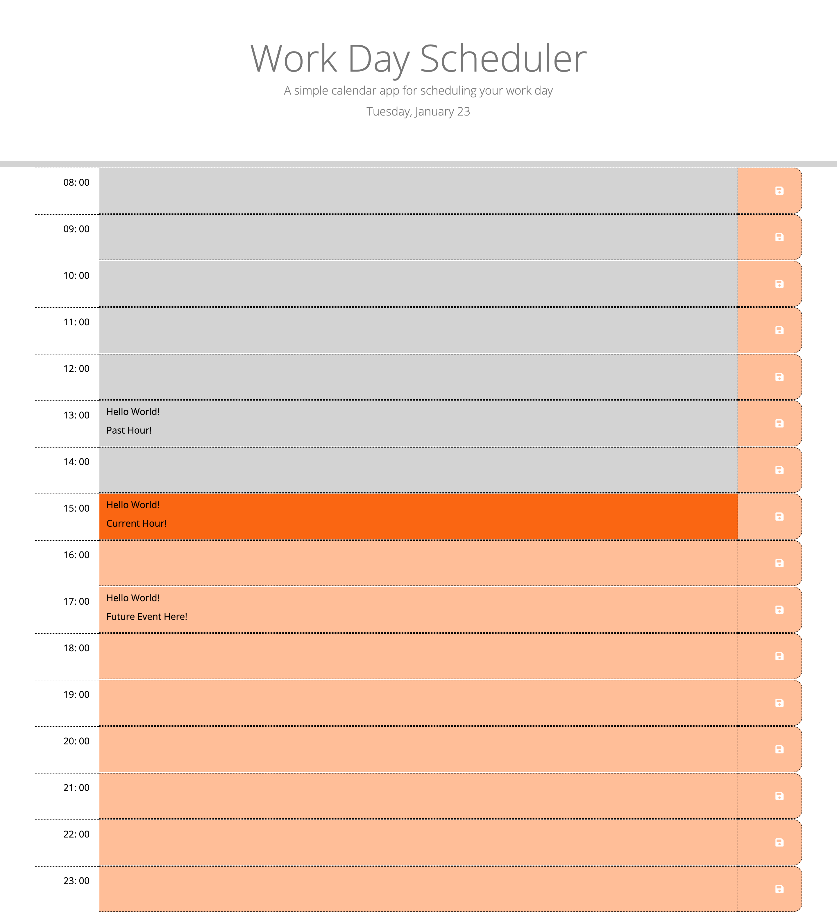

# Challenge7-Work-Day-Scheduler-Third-Party APIs-js

## Description

This project is a browser-based calendar application designed to help employees with busy schedules manage their time effectively. Utilizing jQuery and the Day.js library for date and time manipulation, this application offers dynamically updated HTML and CSS to create an interactive, user-friendly daily planner.

### Motivation

The primary goal of this project is to provide a practical and simple solution for time management. It caters to individuals needing a straightforward tool to add and track important events throughout their workday.

### Specific Features

Dynamic Date Display: Showcases the current day at the top of the calendar using Day.js.

Interactive Time Blocks: Presents time blocks for standard business hours, allowing users to input events.

Color-Coded Time Slots: Each time block is color-coded to indicate whether the time slot is in the past, present, or future.

Local Storage Integration: Events are saved in local storage, ensuring data persistence between page refreshes.

### Technologies Employed

HTML, CSS, JavaScript, jQuery, Day.js

## User Story

"AS AN employee with a busy schedule
I WANT to add important events to a daily planner
SO THAT I can manage my time effectively."

## Usage

Users can interact with the scheduler by clicking on the desired time block to add or edit events. The intuitive design ensures ease of use on various devices.

### Deployment

This application is deployed at a live URL and is accessible for public use.

[Link to the deployed Work Day Scheduler Application](https://natt5.github.io/challenge7-work-day-scheduler/)

### GitHub Repository

The code and documentation are available on GitHub, adhering to best practices in coding and documentation.

[Link to the GitHub repository for the Work Day Scheduler Application](https://github.com/Natt5/challenge7-work-day-scheduler)

## Credits

This project was inspired by the challenges faced by professionals in managing their daily schedules efficiently. Key resources used in this project include:

[Bootstrap v5.3.0-alpha3. Bootstrap's comprehensive library](https://getbootstrap.com)

[Coding Boot Camp: Professional README Guide](https://coding-boot-camp.github.io/full-stack/github/professional-readme-guide)

[Day.js Documentation: For handling date and time in the browser.](https://day.js.org/docs/en/display/format)

[Font Awesome: Icons used in the application, including the fas fa-save icon for the save buttons](https://fontawesome.com)

[Google Fonts: The application's typography](https://fonts.google.com/specimen/Open+Sans)

[How to save localStorage only on click](https://stackoverflow.com/questions/61105569/how-to-save-localstorage-only-on-click)

[JavaScript Dates](https://www.freecodecamp.org/news/javascript-date-time-dayjs/)

[Javascript event binding persistence](https://stackoverflow.com/questions/19032597/javascript-event-binding-persistence)

[jQuery API Documentation: JavaScript library.](https://api.jquery.com)

[Storage API](https://developer.mozilla.org/en-US/docs/Web/API/Web_Storage_API)

## Licence

Refer to the LICENSE in the repo.

## Badges

